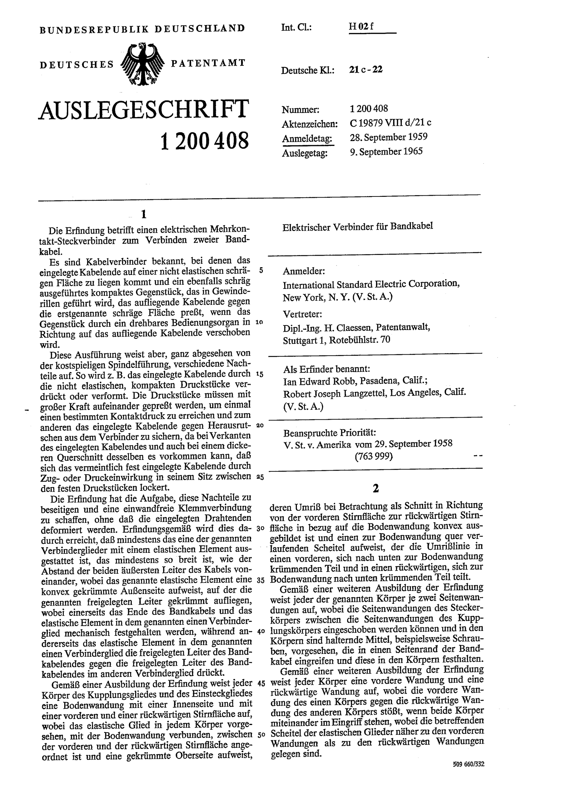
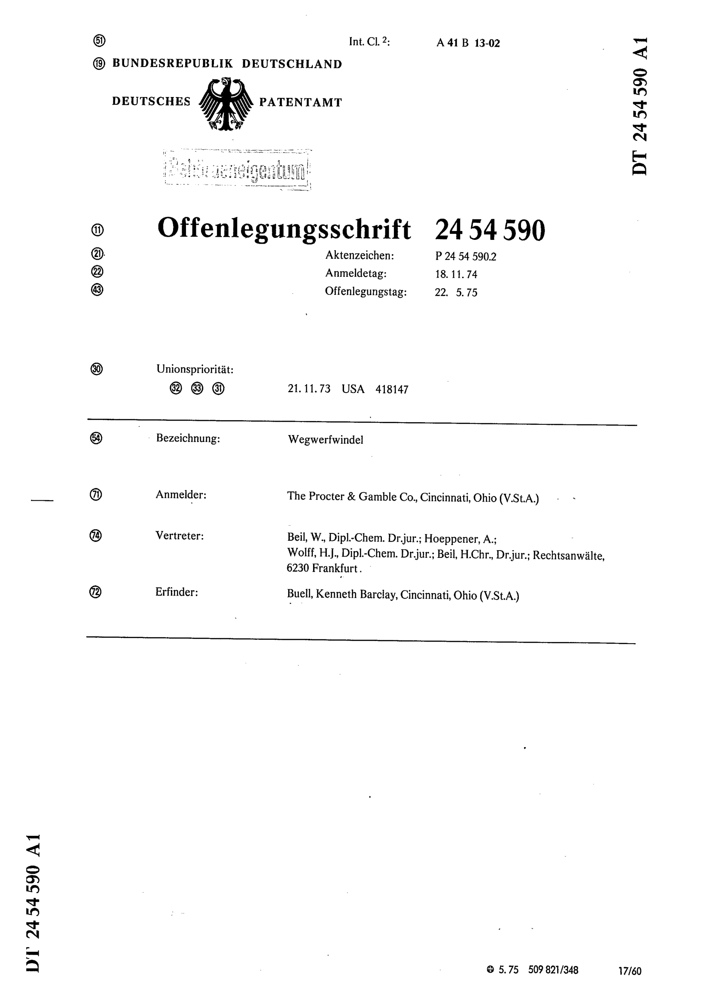

# ANNOTATION GUIDELINES

## Preliminary comments

The patent corpus that we consider for Germany spans the period 1877-1980 and has 2 types of formats.

### *Format 1*, from  DE1C to DE977922C

#### Information display

For this format, the information is given at the top of the document, in a header, just below the seal of the *Patentamt*. This format experiences some evolution over time.

- From publication number DE1C (1877) to DE13105C (1881), the front page of the patent usually does not have any text (at least in the documents that were retrieved by Espacenet) and contain the following information (and in that order):

  - the *reference* of the patent: "*Patentschrift* No (...)"
  - the *name and location* of the assignee (either a person or a firm)
    *E.g*: "S.Frank in Stolp (Pommern)"
  - the *title* of the (claimed) invention. *E.g*: "Neuerungen an Tabakspfeifen" (Innovations for pipes)
  - a *technological class number*, sometimes with the title of this class. *E.g*: "Klasse 44, Kurzwaaren" (Class 44, Dry Goods). This classification is specific to Germany.

- From publication number DE13106C to DE977922C (1973), some changes are introduced with the relevant information being still located in the header. The main difference is that the technological class now comes right below the patent number, while the seal of the patent office is at the top of the document.  Information about the assignee is unchanged, as well as the title of the invention which comes below. See example 2.

More on format 1

- Erfinder: From 1944 onwards, an important item is added right before the name of the assignee: a line specifies the name of the inventor (*Erfinder*) as well as his location.
*E.g* : "Bernhard Ziebell, Braunschweig" or "Eugen Stich in Mannheim".
A second line explicits this:   "(...) *ist als Erfinder genannt worden...*".
- Technological class: In 1957, for the first time an "international class" is specified for the patent (as opposed to the German class).

#### Information extraction

We extract 5 different "entities" from the header of DE patents in format category 1.

Entity|Content|E.g
---|---|---
`ASG`| Assignee full name | ANTON KLEBER `ASG` in SAARBRUCKEN
`INV`| Inventor full name (*Erfinder*) | Frutz Doring `INV`, Berlin-Frohnau ist als Erfinder genannt worden
`LOC`| Location of the assignee/inventor| Demag Akt-Ges. in Duisburg `LOC`.
`OCC`| Occupation of the assignee/inventor (academic title) | Dipl-Ing `OCC` Georg Werner Gaze, Ingolstadt
`CLAS`| Technological class (German system) |  KLASSE 49h GRUPPE 27 D 16736VI/49h `CLAS`

These entities are tied together with 2 types of relations.

| Relation     | Content                          | E.g.                                                         |
| ------------ | -------------------------------- | ------------------------------------------------------------ |
| `LOCATION`   | Links an `ASG`/`INV` to a `LOC`  | MARIUS ALBERT de DION `ASG`--<--`LOCATION`--<--PUTEAUX (Seine, Frankr.) `LOC` |
| `OCCUPATION` | Links an `ASG`/`INV` to an `OCC` | Dr. `OCC`-->--`OCCUPATION`-->--KARL HENKEL `ASG` |

### *Format 2*, from DE977923C to DE978074C and from DE1000001B onwards

This format corresponds to two subformats:

- The first subformat starts with DE1000001B, in 1957.
- The second subformat starts with patent DE1283771, in 1968.

#### Information display

With the second subformat, we get back to a format that does *not* have a body of text.

* In the first frame of the header, one gets the following information:

  * the *reference* of the patent (*Auslegeschrift* # or *Offenlegungsschrift* #).
  * the *technological class number*. *E.g*: "Deutsche Kl.: 21c-22"
  * the *publication date* (*Auslegetag* or *Offenlegungstag*). *E.g*: "Auslegetag: 9.September 1965"

* In the second frame of the header, one gets the following information:

  * the *title* of the invention (*Bezeichnung*). *E.g*: "Bezeichnung: Wegwerfwindel".
  * the *name and location* of the *assignee* (*Anmelder*). *E.g*: "Anmelder: The Procter&Gamble Co., Cincinnati, Ohio (U.St.A)".
  * the *name and location* of the *inventor* (*Erfinder*). *E.g*: "Erfinder: Buell, Kenneth Barclay, Cincinnati, Ohio (U.St.A)".

It seems that the specifically German technological classifications are not even mentioned from 1975 onwards.
When a person is located in Germany, the name of the city is typically accompanied by a zipcode (*e.g*: "7000 Stuttgart", "2000 Hamburg", "8000 München", ...).

> **Note**: Oddly, it appears that some patents are issued after 1957 but have publication number inferior to 1000000. Those patents are published (*ausgegeben*) in or after 1973 and up until 1980. Their format is almost identical to format 2.
The only difference with format 2 is that the document is again presented as a *Patentschrift* (not an *Offenlegungsschrift*) and the publication date is announced by the word *Ausgabetag*.

#### Information extraction

We extract 5 different "entities" from the header of DE patents in format category 2.

| Entity | Content                                              | E.g.                                                         |
| ------ | ---------------------------------------------------- | ------------------------------------------------------------ |
| `ASG`  | Assignee full name                                   | Anmelder: Greer Hydraulics, Inc. `ASG`, Los Angeles, Calif. (V.St.A.) |
| `INV`  | Inventor full name                                   | Erfinder: Knight, David George `INV` Sommershall, Chesterfield (Großbritannien) |
| `LOC`  | Location of the Assignee/Inventor                    | Anmelder: Sharp K.K., Osaka (Japan) `LOC` |
| `OCC`  | Occupation of the Assignee/Inventor (academic title) | Dietrich Jurgen, Dr.-Ing. `OCC`; 7033 Herrenberg |
| `CLAS` | Technological class (German system)                  | Deutsche Kl.: 42 i, 8/80 `CLAS` |

These entities are tied together with 2 types of relations.

| Relation     | Content                          | E.g.                                                         |
| ------------ | -------------------------------- | ------------------------------------------------------------ |
| `LOCATION`   | Links an `ASG`/`INV` to a `LOC`  | The Procter&Gamble Co. `ASG`--<--`LOCATION`--<--Cincinnati, Ohio (U.St.A) `LOC` |
| `OCCUPATION` | Links an `ASG`/`INV` to an `OCC` | Spitzke, Wolfgang `ASG`--<--`OCCUPATION`--<--Ing.(grad.) `OCC` |

## Entities

### Format 1

#### The tag `INV`

The tag `INV` refers to the full name of an inventor. This is a person that is not referred to as the assignee and is sometimes specifically referred to as the inventor (*Erfinder*). The document might introduce the inventor with phrases like "*ist als Erfinder genannt worden*" or "*als Erfinder benannt*", or simply with "*Erfinder* : (name)".

##### Specific cases

- *Inventor=Assignee*: sometimes, the inventor and the assignee are the same person and the document does not repeat the name. In this case, we do not tag further. See example 2 from patent DE1575852A1.
- *Academic title*: in some cases, the inventor has an academic title (see example 3 from patent DE918881C). This title is not part of the tag `INV` but is part of a tag `OCC` (see below)
- *Secret inventor*: some publications do not report the name of the inventor on purpose. In such case, the patent includes the following sentence "*der Erfinder hat beantragt, nicht gennant zu werden*". See for example patent DE825754C. In such case, we do not label any inventor.

##### Examples

**Example 1**: *Standard Case*, from patent DE869602C

> Bela Barenyi  `INV`, Stuttgart-Rohr, ist als Erfinder genannt worden

**Example 2**: *Inventor=Assignee*, from patent DE1575852A1

> Als Erfinder bennant: Erfinder ist der Anmelder

**Example 3**: *Academic title*, from patent DE918881C

> Ing. Karl Nowak `INV`, Wien
>
>  ist als Erfinder gennant worden

#### The tag `ASG`

The tag `ASG` refers to the full name(s) of the person(s) or firm(s) who own(s) the patent rights.

##### Specific Cases

- *Former name*: Do not label the former name of the company when it is given. This is signalled by the German word "*vormals*". See example 3 from patent DE134077C.
- *vertreten*: in the rare cases where an assignee uses a third party to represent her, only label the assignee. See example 4.

##### Examples

**Example 1**: *Standard Case* with a firm, from patent DE283698C
> SIEMENS-SCHUKERT WERKE G.M.B.H.  `ASG` IN SIEMENSSTADT B. BERLIN

**Example 2**: *Standard Case* with several persons, from patent DE170522C
> AUGUST REINHOLD ILCHMANN  `ASG` IN DRESDEN, GUSTAV ADOLF RAUER `ASG` IN DRESDEN-RADEBEUL UND EHREGOTT RICHTER  `ASG` IN DRESDEN

**Example 3**: *Specific Case 1 (Former Name)* from patent DE134077C

> ELEKTRIZITÄT-AKTIEN-GESELLSCHAFT  `ASG` VORMALS SCHUKERT&CO IN NÜRNBERG

**Example 4**: *vertreten* from patent DE824442C**

> Deutsche Bundesbahn `ASG`  vertreten durch das Eisenbahn-Zentralamt Minden, Minden (Westf.)

#### The tag `LOC`

The tag `LOC` refers to the full location sequence. It is usually the name of a city and a region (or state, or province) in which the city is located.

##### Specific cases

- *District*: When the assignee is located in Germany, the document might go as far as to give a particular district within the assignee's city. See example 5. More rarely, only the district (without the city) is provided. See example 6.

- *Former City*: Some cities mentioned by sufficiently old patents might not exist anymore, at least as cities (they might have become part of a larger agglomeration at some point between the publication and today).

##### Examples

**Example 1**: *Standard Case* with a standalone city, from patent DE13106C

>  HERMANN SCHULZ in RATIBOR `LOC`

**Example 2**: *Standard Case* with a German city and its Land, from patent DE872632C

> Friedrich Stemmermann in Sinzheim bei Bühl (Bad.) `LOC`

*N.B*: The parenthesis is an abbreviation for Baden-Württemberg.

**Example 3**: *Standard Case* with a city and its country, from patent DE153621C

> GEORGE JAMES GOODALL IN PORTHILL (ENGL.)`LOC`.

*N.B*: The parenthesis is an abbreviation for Baden-Württemberg.

**Example 4**: *Standard Case* with a city, a region/state and a country from patent DE887191C
>  Scovill Manufacturing Company, Waterbury, Conn. (U.St.A)`LOC`.

**Example 5**: *District*, from patent DE283698C

> SIEMENS-SCHUKERT WERKE G.M.B.H IN SIEMENSSTADT B. BERLIN`LOC`.

**Example 6**: *District*, from patent DE93717C

>  KALKER WERKZEUGMASCHINENFABRIK L.W.BREUER, SCHUMACHER&CO. IN KALK`LOC`.

*N.B*: Kalk is a district of Köln.

**Example 7**: *Former City*, from patent DE78165C

> H.W. SOLFRIAN IN HOLSTERHAUSEN BEI EICKEL `LOC`

*N.B*: Holsterhausen is now part of the city Herne.

#### The tag `OCC`

The tag `OCC` refers to the academic title of an `INV` or `ASG`. It typically corresponds to a prefix before the name which is an abbreviation of a title (e.g. Dr., Ing. etc...).

##### Examples

**Example 1**: from patent DE975335C

> Dr. `OCC` Wilhelm Michael, Ludwigshafen/Rhein, und Dr. `OCC`  Wolfgang Jäckh, Heidelberg sind als Erfinder gennant worden

#### The tag `CLAS`

The tag `CLAS` refers to the German technological class that usually appears on patents up until 1975.
It can encompass more or less details.

Do not include "*Deutsche Kl*" in the label.

When two classifications are given (international and German) only label the German's (see examples 3 and 4)

Do not label the description of the class (see example 1)

Label also the subclass (see example 4 and 5)

##### Specific cases

##### Examples

**Example 1**: *standard case* with a class number and its brief description, from patent DE4010C**
>  Klasse 44 `CLAS` KURZWAAREN

**Example 2**: *standard case* with a class number and a group number, from patent DE283698C**

>  KLASSE 21d GRUPPE 19 `CLAS`

**Example 3**: *standard case* with a German class code and an international class code, from patent DE1200408

> Int.Cl.: H02f
> Deutsche Kl.:21c-22 `CLAS`

**Example 4**: *standard case* with a German class code and an international class code with a subclass, from patent DE949207C

> KLASSE 49a GRUPPE 3603 `CLAS`
> INTERNAT. KLASSE B23b
> B 30976 lb/494 `CLAS`

**Example 5**: *standard case* with a class number, a group number and additional information from patent DE923434C

> KLASSE 20h GRUPPE 7
> St 5364 II/ 20h `CLAS`

### Format 2

#### The tag `INV`

The tag `INV` refers to the full name of an inventor. This is a person that is refered to as *Erfinder*. It appears after the item *Als Erfinder banannt:* or simply after *Erfinder:*.

##### Specific cases

##### Examples

**Example 1**: *standard case*

**Example 2**: *als erfinder benannt* from patent DE2054787A1

> Als Erfinder benannt: Ohyama, Yasishi `INV`;  Miyazawa, Saduyuki `INV`, Kyoto (Japan)

#### The tag `ASG`

The tag `ASG` refers to the full name of an assignee, either a firm or a person. This is a person that is refered to as *Anmelder*. It appears after the item *Anmelder:*. When the assignee lives outside Germany, the patent also specifies the name of the patent attorney (*Vertreter*). We are not interested in this information and the associated entities (`LOC` and `OCC` namely).

##### Specific cases

##### Examples

**Example 1**: *standard case* from patent DE2818594A1

> Anmelder: Greer Hydraulics, Inc., Los Angeles, Calif. (V.St.A.)

#### The tag `LOC`

Similar to format 1.

##### Specific cases

- *full address:* in some rare instances, the inventor or the assignee gives its full address at the top of the body (in addition to giving its city in the header). See example 2. In more frequent cases, the full address is given in the header (see example 3).

##### Examples

**Example 1**: *standard case* from patent DE1201058B

> Anmelder: General Aniline & Film Corporation, New York, N.Y. (V.St.A) `LOC`

**Example 2**: *full address* from patent DE2745546A1

> Anmelder: Katzer, Rudolf, Graz (Osterreich) `LOC` [...]
> Rudolf Katzer
> Klosterwiesgasse 29
> 8010 Graz . Osterreich `LOC`

**Example 3**: *full address* from patent DE1026733B

> Anmelder: Pintsch Bamag Aktiengesellschaft Berlin NW 87, Reuchlinstr. 10-17 `LOC`

#### The tag `OCC`

##### Specific cases

##### Examples

**Example 1**: *standard case* from patent DE1158387B

> Dr. techn. `OCC` Erns Fiala, Sindelfingen (Wurtt.)

**Example 2**: *title after the name* from patent DE2814877A1

> Erfinder: Diekman, Peter, Dr. `OCC`, 2300 Kiel

#### The tag `CLAS`

Similar to format 1.

##### Specific cases

- *Class KL:* In some cases, the classe is given in the form: KL.XXXXXX, in such case, we label the "KL." See example 2.

##### Examples

**Example 1**: *standard case* from patent DE1218989B

> Deutsche Kl: 8f-3.51 `CLAS`

**Example 2**: *Class KL.* from patent DE1158387B

> KL.63C 42 `CLAS`
> INTERNAT.KL. B62 d

#### The tag `CIT`

In some rare occasion, the origin of the firm is precised. This seems to only be the case for US firms. The `CIT` is either printed in full letter (example 1) or with abbreviations (example 2).

##### Specific cases

##### Examples

**Example 1**: *nach den Gestzen* from patent DE1216661B

> Anmmelder: Revere Copper and Brass Incorporated, eine Gesellschaft nach den Gesetzen des Staates Maryland `CIT`, New York, N.J. (V.St.A.)

**Example 2**: *in parenthesis* from patent DE2500682A1

> Anmelder: Process Systems, INc. (N.D.Ges. d.Staates Nevada), Salt Lake City, Utah (V.St.A.)

## Relationships

See [XX\_REL\_ANNOTATION\_GUIDELINES.md](./XX_REL_ANNOTATION_GUIDELINES.md).

## Examples

##### Example 1: Format 1 before 1881

##### Example 2: format 1 without inventor

##### Example 3: format 1 with inventor

##### Example 4: format 2, first subformat

##### Example 5: format 2, second subformat

