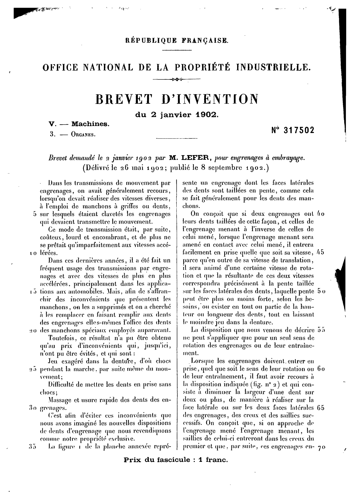
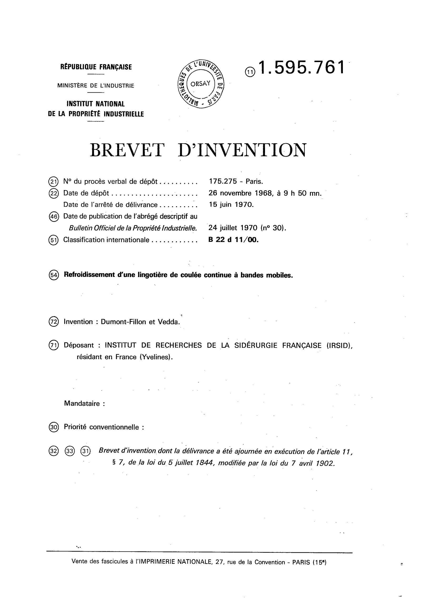

# ANNOTATION GUIDELINES

The patent corpus that we consider for France spans the period 1902-1980 and has 2 types of formats.

## Preliminary comments

The patent corpus that we consider for France has 2 types of formats and spans the period 1902-1980.

The first format spans spans the period 1902-1969 (from FR317502A to FR1569050A) while the second format goes from 1969 to the end of our period of interest (from FR1569051A to FR1605567A and then from FR2000001A1).

More on patents numbering

The patent numbers from 1605567 to 2000000 do not seem to exist. The patents with letter seem to stop at FR1605566A and those with code A1 start at FR2000001. The code of those subsequent patents can also end in A5 if the publication is unique (otherwise, the A1 publication is associated with a later but basically identical B1 publication).

### *Format 1*, from FR317502A to FR1569050A.

#### Information display

The information we are interested is in the header.

The upper part of the header contains generic terms like the name of the institution and its seal, the patent's publication number and its technological class code.

The lower part of the header contains a brief description of the content of the invention and the information about the assignee (name and location).
Those two distinct information can be blended together in the same sentence or not.
Finally a last sentence gives indicates the date at which the patent has been granted as well as the publication date.

More on format 1

We notice some slight changes within this format across time.

- Technological class: up until FR1096200A, the patents provide a French technological class. From patent FR1096201A to patent FR1196800A, both the French technological class as well as the international technological class are mentioned in the header. Finally, starting with patent FR1196801A, only the international technlogical class is retained.
- Location: It appears only from FR328212A. The assignee's country of residence is then mentioned. Starting with the patent FR371349A, the county is mentioned when the assignee's country is France (otherwise, only the country is reported).

#### Information extraction

We extract 4 different "entities" from the header of FR patents in format category 1.

  Entity|Content|E.g
  ---|---|---
 `ASG`| Assignee full name | M. Robert John Jocelyn SWAN `ASG` résidant en Angleterre
 `INV`| Inventor full name | (Demande de brevet déposée aux Etats-Unis d'Amérique au nom de  M. Ladislas Charles MATSCH `INV`)
	`LOC`| Location of the assignee/inventor| M. Louis LEGRAND résidant en France `LOC`.
	`CLAS`| Technological class (French system) |  XII Instruments de précision 3 POIDS ET MESURES, INSTRUMENTS DE MATHEMMATIQUES`CLAS`

Assignees (or inventors) and their corresponding geographic indication are tied together through the relation "LOCATION".

| Relation     | Content                          | E.g.                                                         |
| ------------ | -------------------------------- | ------------------------------------------------------------ |
| `LOCATION`   | Links an `ASG`/`INV` to a `LOC`  | M.Frederic PERDRIZET `ASG`--<--`LOCATION`--<--France (Gironde) `LOC` |

### *Format 2*, from FR1569051A to FR1605567A and then from FR2000001A1.

#### Information display

The main body of text disappears from the first page of the patent and information are presented in a more "tabulated" manner: there are lines and they are associated with a number. For instance, in all of those "Format 2" patents, the line with the number 54 gives the title of the invention.

In this format:
- The "Déposant" refers to the assignee. It contains its name as well as its location (usually introduced by the expression "*résidant en/au/aux*").
- The line "*Invention*" (or "*Invention de*") can be filled with the name of the inventor, although it is often empty (for instance, FR1595761A has an inventor, while FR2000001A1 does not).

More on format 2

Attributes reported but not extracted:

- Mandataire: A "Mandataire" is a specilalised entity that files the patents on behalf of their client -the inventor. It appears in format 2.
- Technological class: The international technology class is reported

#### Information extraction

We extract 3 different "entities" from the header of FR patents in format category 2.

Entity|Content|E.g
  ---|---|---
 `ASG`| Assignee full name | Déposant: Société dite: SALZDETFURTH A.G `ASG`, résidant en République Fédérale d'Allemagne
 `INV`| Inventor(s) full name |  Invention de: Takaya Endo`INV`, Shui Sato`INV`, Shoji Kikuchi`INV`, Koichi Takabe`INV`, Hiroyuki Imamura `INV`, Tamotsu Kozima`INV` et Tugumoto Usui `INV`
	`LOC`| Location of the assignee/inventor| Déposant: Société dite: ROBERT BOSCH GBMH, résidant en République Fédérale d'Allemagne `LOC`.

Assignees (or inventors) and their corresponding geographic indication are tied together through the relation "LOCATION".

| Relation     | Content                          | E.g.                                                         |
| ------------ | -------------------------------- | ------------------------------------------------------------ |
| `LOCATION`   | Links an `ASG`/`INV` to a `LOC`  | KONISHIROKU PHOTO INDUSTRY CO LTD `ASG`--<--`LOCATION`--<--Japon `LOC` |

## Entities

### Format 1

#### The tag `ASG`

The tag `ASG` refers to the full name of an assignee, either a firm or a person.

##### Specific cases

- *Former name*: When the assignee is a firm whose name changed over time, its former name might be reported along with its current one. We do not keep the former name. See example 4.

##### Examples

**Example 1: *Standard Case* with several persons, from patent FR504101A**
> MM.  Joseph MARTINENGO `ASG` et  Jean-Baptiste GAUDON `ASG` résidant en France (Loire)

**Example 2: *Standard Case* with a person and a firm, from patent FR60167E**
> M.  Franz DOMALSKY `ASG` et  SOCIETE DES ACIERIES DE LONGWY `ASG` résidant: le 1er en Sarre; la 2e en France (Seine)

**Example 3: *Standard Case* with a firm, from patent FR953956A**
> Société dite:  CURRAN INDUSTRIES, INCORPORATED `ASG` résidant aux Etats-Unis d'Amérique

**Example 4: *Former name*, from patent FR1103500A**
> Société anonyme dite:  SOCIETE D'INSTALLATIONS GENERALES ET D'AGENCEMENTS (S.I.G.E.A.C) `ASG` [anciennement H.CAVECCHI ET FILS] résidant en France (Seine)

#### The tag `INV`

The tag `INV` refers to the full name of an inventor (this person is explicity referred to as the inventor). Format 1 patents often don't have an inventor who is explicitly referred to as such (meaning, distinctively from the assignee).

**Example 1: *Standard Case* with several inventors, from patent FR1288300A**
> Procédé de fabrication des matières mousseuses contenant des groupes uréthane
> (Invention:  Rudolf MERTEN `INV`,  Günther LOEW `INV` et   Erwin WINDEMUTH `INV`)

#### The tag `LOC`

Refers to an indication about the location. It is usually the name of a country when the assignee is not a resident of France. Otherwise, it may be the name of a county with the name of the country (France) in parentheses.
*N.B*: It can happen that no location is associated with an assignee (*cf* FR318016A).

**Example 1: *Standard Case* with a foreign country, from patent FR1196800A**
> Société américaine dite: BENDIX AVIATION CORPORATION, résidant aux  Etats-Unis d'Amérique `LOC`.

#### The tag `CLAS`
Technological class of the patent: the classification is specific to France. In some format 1 patents, only the CPC (international) class is reported, in which case we do not tag anything.

**Example 1: *Standard Case* without text, from patent FR842579**
>  BREVET D'INVENTION
>  Gr.10-Cl.4 `CLAS` 

**Example 2: *Standard Case* with text, from patent FR322801**
>  BREVET D'INVENTION du 5 juillet 1902
>  IV. ARTS TEXTILES
>  6. TULLES, DENTLLES ET FILETS, BRODERIES `CLAS` 

### Format 2

#### The tag `ASG`

The tag `ASG` refers to the full name of an assignee, either a firm or a person. The name of the assignee is found in line 71: "*Déposant:*".

##### Specific cases

- *Former name*: When the assignee is a firm whose name changed over time, its former name might be reported along with its current one. We do not keep the former name. See example 2.

**Example 1: *Standard Case* with a firm, from patent FR2227040A1**
> Déposant:  MARATHON OIL COMPANY `ASG`, résidant aux Etats-Unis d'Amérique.

**Example 2: *Former name*, from patent FR2183816A1**
> Déposant: Société dite:  FARBWERKE HOECHST A.G` `ASG` VORMALS MEISTER LUCIUS & BRUNING, résidant en République Fédérale d'Allemagne.

#### The tag `INV`

The tag `INV` refers to the full name of an inventor. This is a person that is not referred to as the assignee and is specifically referred to as the inventor. Its name is typically found in line 72: "*Invention:*" or "*Invention de:*".

##### Specific cases

- *Inventor in lines 31-33*: Some patents do not report the name of the inventor in the usual line (72) but instead indicate it in lines 31-33 under the entry "Priorité revendiquée". See example 2.

**Example 1: *Standard Case* with several inventors, from patent FR2227040A1**
> Invention de:  LaVaun S. Merrill Jr. `INV`,  Dennis Eugene Drayer `INV`,  William Barney Gogarty `INV` et  George Arthur Pouska `INV`.

**Example 2: *Inventor in lines 31-33*, from patent FR2306539A1**
> Priorité revendiquée: Demande de brevet déposée aux Etats-Unis d'Amérique le 31 mars 1975 au nom de  Anthony Sabatino `INV`.

#### The tag `LOC`

Refers to an indication about the location. Again, when assignees are lcoated outside France, the geographic indication usually boils down to the name of the country.

##### Specific cases

- *Address*: Sometimes, the patent document might give the full address of the assignee. This only happens for assignees located in France. For the sake of consistency, we only keep the name of the city (and associated zipcode when it is provided). See example 2.

- *State of the Headquarters*: Typically in the case of an American firm as the assignee, a patent might report the US state in which this firm is headquartered. Again, because the instances are rare and for the sake of consistency, we tag only he country of residence. See example 3.

**Example 1: *Standard Case* with a foreign (different from France) country, from patent FR2227040A1**
> Déposant: MARATHON OIL COMPANY, résidant  aux   Etats-Unis d'Amérique `LOC`

**Example 2: *Address*, from patent FR2132583A1**
> Déposant: GUILLON Marcel, 6, avenue Paderi, Regina Cottage,  06-Nice `LOC`

**Example 2: *State of the Headquarters*, from patent FR2259617A1**
> Déposant: Organisme dit: UNIVERSITE DE PENNSYLVANIE. Constituée selon les lois de l'Etat de Pennsylvanie, résidant aux Etats-Unis d'Amérique `LOC`.

## Relationships

See [XX\_REL\_ANNOTATION\_GUIDELINES.md](./XX_REL_ANNOTATION_GUIDELINES.md).

## Examples

##### Example 1: Format 1 without geographic indications

##### Example 2: Format 1 with a geographic indication (country only)

##### Example 3: Format 1 with an inventor

##### Example 4: Format 2 without an inventor and with a foreign (non French) assignee

##### Example 5: Format 2 with an inventor and a county (French assignee)

