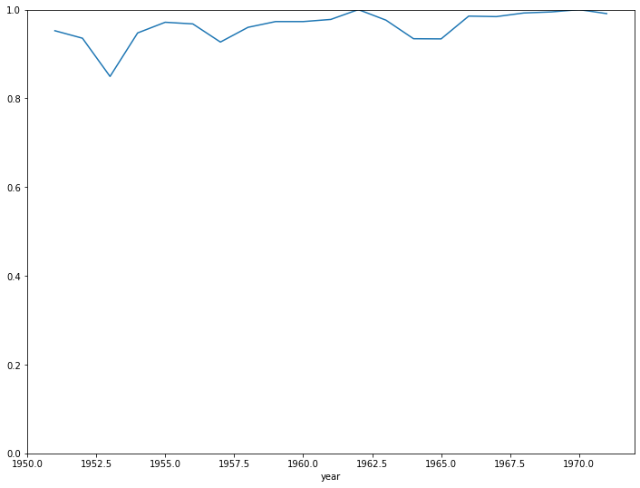

# DATE IMPUTATION

## Problem

Before 1972 (incl), the publication date of DD patents is missing.
Frontier is fuzzy, patents publication numbers are not exactly chronological but nearly. This makes it hard to manually find the latest publication number for each vintage.

!!! note
    The above figure reports the patent number (x-axis) and the publication year (ausgabe datum) labeled by hand of a random sample of 1k+ DD patents with missing date.

## Approach

The idea is to look iteratively at each publication year and find the best threshold (in terms of f1) to delimit between the year and year+1. We obtain a stepwise prediction function where each threshold can be characterized by an f1-score indicating how "good" the threshold is.

## Results

The overall accuracy of the prediction function is 93% on the training set (for the sake of simplicity, we don't have a test set)

### Date imputation

!!! note "Reading"
    Patents with number below 3 are imputed publication year 1951, between 3 and 1723 are imputed publication year 1952, etc

year|threshold
---|---
1951|DD-3
1952|DD-1723
1953|DD-6164
1954|DD-8769
1955|DD-10939
1956|DD-12386
1957|DD-14208
1958|DD-16107
1959|DD-18028
1960|DD-20460
1961|DD-22493
1962|DD-24412
1963|DD-26646
1964|DD-34886
1965|DD-44171
1966|DD-53027
1967|DD-59516
1968|DD-65066
1969|DD-70534
1970|DD-78709
1971|DD-86784
